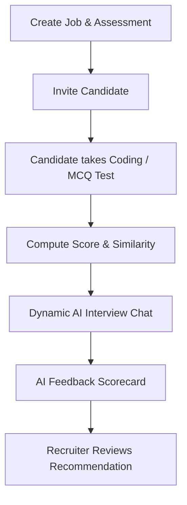
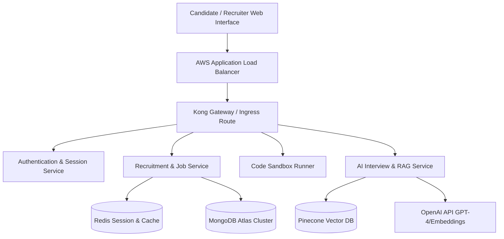

# Goal Description: Build HireNova AI Recruitment & Interview Assessment Platform

Design and construct a production-ready, multi-tenant SaaS platform that automates recruitment operations (Resume screening, candidate tracking, MCQ/Coding assessments, AI interview flows) with absolute data isolation, high scalability, and robust security.

---

## User Review Required

> [!IMPORTANT]
> **Code Sandbox Isolation**: The coding assessment execution engine requires containerized isolation (e.g., gVisor, firecracker, or isolated AWS Lambda runners) to prevent Remote Code Execution (RCE) attacks on the host server. We plan to build a local mock sandbox using Docker container limits for development, transitioning to gVisor in staging/production.

> [!WARNING]
> **OpenAI Cost Limits**: Running real-time RAG screening and interactive conversational AI interviews will consume OpenAI tokens significantly. Tenants will be monitored using an `aiUsage` schema to enable consumption-based tiering or direct usage billing.

---

## Open Questions

> [!NOTE]
> **1. AI Interview Medium**: In Phase 1 MVP, should the AI interview focus entirely on dynamic text-based chat, or do we require WebRTC-based audio/video streaming with speech-to-text directly in the initial release?
> 
> **2. Sandbox Execution**: For code runner compiler execution, are there specific execution limits (CPU, RAM, timeout) required beyond the proposed standard limits (0.5 CPU cores, 256MB RAM, 3-second execution timeout)?

---

## Proposed Changes

We are initializing a brand-new multi-tenant project directory. Below is the proposed layout of components and configuration files to be created across the frontend and backend.

### Project Bootstrapper & Workspace Configurations

#### [NEW] [package.json](file:///c:/Users/Jitendra/Desktop/HireNova/package.json)
Root package file containing workspace configurations to coordinate frontend and backend development.

#### [NEW] [docker-compose.yml](file:///c:/Users/Jitendra/Desktop/HireNova/docker-compose.yml)
Docker Compose setup running MongoDB, Redis, and local workspace instances.

---

## Complete Enterprise Specification

### 1. Product Requirements Document (PRD)
*   **Vision**: Build an automated recruitment funnel from resume screening to final AI-driven interview feedback.
*   **Key Persona Workflows**:
    *   *Recruiter*: Creates job, uploads resumes, reviews candidate rankings and assessments.
    *   *Candidate*: Completes coding test, does interactive AI interview, reviews feedback (if enabled).
    *   *Admin*: Configures workspace, manages users, checks billing logs.

### 2. Business Requirements
*   **Multi-Tenant Isolation**: Strict logical data isolation. Every query must filter using the `companyId` header.
*   **Subscription Model**: Starter, Pro, Enterprise tiers. Metered billing using Stripe and track tokens in `aiUsage`.

### 3. Functional Requirements
*   **Job Management**: CRUD jobs, publish, close, save templates, configure stage pipeline.
*   **Candidate Tracking**: Resume parsing, notes, stage progression, candidate profile builder.
*   **Assessment System**: MCQ and Coding problem evaluation with hidden test cases.
*   **AI Interview System**: Adaptively generates interview questions based on candidates' skills, resumes, and job roles.

### 4. Non-Functional Requirements
*   **Availability**: 99.95% availability targets with multi-region replication.
*   **Latency**: REST API responses <200ms.
*   **Security**: OWASP compliance, SOC2-audit logging, password hashing with bcrypt, JWT authorization tokens, HTTPS.

### 5. User Stories
*   *US-1*: As a Recruiter, I want to create a Job posting and assign a specific assessment to it.
*   *US-2*: As a Candidate, I want to accept an invite, take an MCQ & coding test with runtime tracking, and submit my results.
*   *US-3*: As an Interviewer, I want to view the AI scorecard report detailing technical strength, behavioral signals, and communication.

### 6. User Flows

### 7. Information Architecture
*   **Admin Console**: Tenant settings, billing logs, RBAC matrix.
*   **Recruiter Portal**: Jobs, Candidates, Pipeline View, Custom Assessment banks.
*   **Candidate Portal**: Assessment center, Monaco code editor workspace, Chat interface for AI interviews.

### 8. System Design & High-Level Architecture

### 9. Database Design (MongoDB Atlas)
All tenant collection records require: `companyId`, `createdBy`, `updatedBy`, `createdAt`, `updatedAt`.

#### Collections & Indexes
*   `companies`: Tenant details. Index: `{ slug: 1 }` (unique).
*   `users`: Authentication profile, role assignment. Index: `{ email: 1 }` (unique), `{ companyId: 1 }`.
*   `jobs`: Job descriptions and stages. Index: `{ companyId: 1, status: 1 }`.
*   `candidates`: Talent profile, parsed resume parameters. Index: `{ companyId: 1, email: 1 }`.
*   `applications`: Mapped candidate-job applications. Index: `{ jobId: 1, currentStage: 1 }`.
*   `assessments`: Test configs. Index: `{ companyId: 1 }`.
*   `assessmentAttempts`: Interactive candidate attempts, scores, and status logs. Index: `{ assessmentId: 1 }`, `{ candidateId: 1 }`.
*   `codingProblems`: Core DSA bank. Index: `{ slug: 1 }` (unique).
*   `mcqQuestions`: Core quiz bank. Index: `{ category: 1 }`.
*   `questionExposureHistory`: Exposure counts, correct rate. Index: `{ questionId: 1 }`.
*   `interviews`: Chat transcripts and session tokens. Index: `{ companyId: 1, status: 1 }`.
*   `feedbackReports`: Scorecard evaluations. Index: `{ interviewId: 1 }`.
*   `notifications`: Email/webhook outputs. Index: `{ userId: 1, status: 1 }`.
*   `subscriptions`: Billing information. Index: `{ companyId: 1 }` (unique).
*   `auditLogs`: Read-write operations. Index: `{ companyId: 1, timestamp: -1 }`.
*   `aiUsage`: API cost records. Index: `{ companyId: 1, timestamp: -1 }`.

### 10. API Design (Endpoints Summary)
*   `POST /api/v1/auth/login` | `POST /api/v1/auth/register`
*   `POST /api/v1/jobs` | `GET /api/v1/jobs`
*   `POST /api/v1/candidates/bulk-upload`
*   `POST /api/v1/assessments/attempts/:attemptId/execute` (Run code sandbox)
*   `POST /api/v1/interviews/:id/message` (Receive LLM responses)

### 11. Frontend Architecture
*   **Framework**: React (TypeScript) with Tailwind CSS, ShadCN UI, Redux Toolkit, and React Query.
*   **Folder Structure**: Feature-based slices (Auth, Jobs, Candidates, Assessments, Analytics).

### 12. Backend Architecture
*   **Platform**: Node.js, Express, TypeScript.
*   **Execution Safety**: Dynamic compilation processes are isolated via Docker commands executing under restricted user privileges.

### 13. AI & RAG Architecture
*   **Parsing**: OCR and PyMuPDF text ingestion from resumes.
*   **Vector Database**: Pinecone vector indexing with metadata filtering based on `companyId`.
*   **Search**: Query cosine-similarity embedding search to rank candidates on job requirements.

### 14. DevOps & Monitoring
*   **Orchestration**: Kubernetes configs (Deployment, Service, Ingress, Horizontal Pod Autoscaler).
*   **CI/CD**: GitHub Actions building Docker containers, running security scans (Trivy), and deploying to AWS EKS.
*   **Observability**: Prometheus tracking request latency, Loki for central log management, and Grafana for dashboards.

### 15. Scaling & Roadmap
*   **Scale**: Up to 100k concurrent users using horizontal pod autoscaling and Redis caching.
*   **Roadmap**:
    *   *Phase 1*: MVP tenant core backend (Auth, Jobs, basic ATS).
    *   *Phase 2*: Coding Sandbox assessment runner and MCQ builder.
    *   *Phase 3*: AI interviews and vector RAG screen integrations.
    *   *Phase 4*: Enterprise security auditing, auto-scaling deployment.

---

## Verification Plan

### Automated Tests
*   `npm run test`: Jest testing coverage for tenancy middleware, code-sandbox routing, and API endpoint validations.

### Manual Verification
*   Deploy container instances locally via `docker-compose`. Validate tenant data isolation by requesting resources of Tenant B using Tenant A authentication tokens (must return 403 Forbidden).
*   Mock code execution submissions with malicious infinite loop and OS level command scripts. Confirm sandbox correctly caps execution times at 3 seconds and prevents host OS resource reads.
